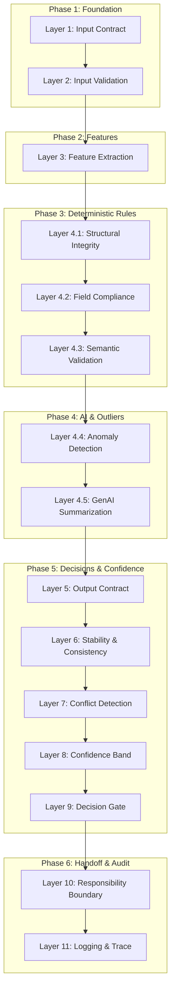

# Data Quality Scoring Engine (DQS) - Project Guide & Architecture Documentation

This document provides a comprehensive guide to the **Data Quality Scoring Engine (DQS Engine)** codebase, detailing its core objectives, the 15-layer pipeline architecture, core mathematical formulas, project structure, and operational verification instructions.

---

## 1. Project Objectives & Core Principles

The DQS Engine is a transactional data auditor designed to process financial data streams (modeled on the VISA transaction format). It operates on two fundamental design principles:

1. **Deterministic Explanations:** Every transaction's quality rating must have a clear mathematical explanation. The system calculates a Data Quality Score (DQS) from 0 to 100 based on 7 distinct quality dimensions.
2. **`Rules > AI` Governance:** Machine learning and generative AI models act only as non-blocking advisors. Deterministic business and structural rules have absolute override authority. If a deterministic validation check fails, the transaction is rejected or escalated regardless of any "clean" prediction from the AI.

---

## 2. The 15-Layer Execution Pipeline

The processing pipeline is organized into **15 modules (layers)** across **6 logical phases**:



### Phase Details

#### Phase 1: Foundation (Layers 1-2)
* **Layer 1: Input Contract:** Verifies the format of the schema manifest.
* **Layer 2: Input Validation:** Checks for null fields, duplicate transaction IDs, and scans fields with regex patterns to prevent SQL Injection and Script tags.

#### Phase 2: Feature Extraction (Layer 3)
* **Layer 3: Feature Extraction:** Computes 35+ numerical, statistical, and temporal features (e.g. transaction age, card expiry remaining, weekend flags, log-transformed amounts, amount z-scores).

#### Phase 3: Deterministic Inference (Layers 4.1-4.3)
* **Layer 4.1: Structural Integrity:** Validates shape, format, and data types of the records. Discards corrupted data.
* **Layer 4.2: Field Compliance:** Computes the composite DQS score (0-100) per record.
* **Layer 4.3: Semantic Validation:** Evaluates business logic constraints (e.g., matching net amount difference formula: `Net = Gross - Interchange - Gateway Fee`).

#### Phase 4: AI Inference (Layers 4.4-4.5)
* **Layer 4.4: Anomaly Detection:** Applies an online `IsolationForest` ML model to flag outlier transactions.
* **Layer 4.5: GenAI Summarization:** Formulates clear, natural-language executive summaries of the transaction quality using the Gemini API.

#### Phase 5: Output & Decision Routing (Layers 5-9)
* **Layer 5: Output Contract:** Validates layer output compatibility and packs details into a unified payload format.
* **Layer 6: Stability & Consistency:** Assesses statistical distributions (mean, skewness, kurtosis) across record batches to detect internal contradictions.
* **Layer 7: Conflict Detection:** Identifies contradictions between rules and ML anomaly predictions (e.g., record passes all rules but is classified as highly anomalous).
* **Layer 8: Confidence Band:** Computes a confidence score (0-100%) by applying deterministic penalty deductions to a baseline of 100.
* **Layer 9: Decision Gate:** Finite State Machine (FSM) that routes records to one of four states: `SAFE_TO_USE`, `REVIEW_REQUIRED`, `ESCALATE`, or `NO_ACTION`.

#### Phase 6: Governance & Audit (Layers 10-11)
* **Layer 10: Responsibility Boundary:** Allocates organizational ownership, flags SLAs, and formats notification templates based on the decision state.
* **Layer 11: Logging & Trace:** Generates immutable, timestamped execution reports keyed to a unique `trace_id`.

---

## 3. Core Calculations & Decision Matrices

### A. DQS Scoring Math
Each record is scored on 7 dimensions. The composite DQS is computed as:

$$\text{DQS\_base} = \frac{\sum (\text{Score}_{\text{dim}} \times \text{Weight}_{\text{dim}})}{\sum \text{Weight}_{\text{dim}}}$$

* **Weights:**
  * Completeness: 0.20
  * Accuracy: 0.20
  * Validity: 0.15
  * Uniqueness: 0.10
  * Consistency: 0.15
  * Timeliness: 0.10
  * Integrity: 0.10

### B. Confidence Band Deductions
Uncertainty accumulates through deterministic deductions starting from a base of **100**:

| Factor / Issue | Condition | Deduction |
| :--- | :--- | :--- |
| **DQS Level** | DQS is between 50 and 70<br>DQS is below 50 | **-10**<br>**-40** |
| **Outlier Severity** | Anomaly score between 0.5 and 0.7<br>Anomaly score above 0.7 | **-20**<br>**-30** |
| **Rule Failures** | Has structural violations<br>Has semantic violations | **-15 per violation** (cap: -30)<br>**-15 per violation** (cap: -30) |
| **Consistency Flags** | Active consistency warnings | **-10 per flag** (cap: -30) |
| **Conflicts** | Active Signal conflicts<br>High-severity conflicts | **-5 per conflict**<br>**-10 per high-severity conflict** |

*A final multiplication factor adjustment based on the batch stability score ($S$) is applied: $\text{Confidence} = \text{Score} \times (0.8 + 0.2 \times \frac{S}{100})$.*

---

## 4. Codebase Directory Layout

```
.
├── .venv/                         # Python Virtual Environment
├── graphify-out/                  # Knowledge Graph output (contains graph.json, GRAPH_REPORT.md)
├── src/                           # Main source code directory
│   ├── layers/                    # The 15 individual pipeline layers
│   │   ├── layer1_input_contract.py
│   │   ├── layer2_input_validation.py
│   │   ├── layer3_feature_extraction.py
│   │   ├── layer4_1_structural.py
│   │   ├── layer4_2_field_compliance.py
│   │   ├── layer4_3_semantic.py
│   │   ├── layer4_4_anomaly.py
│   │   ├── layer4_5_summarization.py
│   │   ├── layer5_output_contract.py
│   │   ├── layer6_stability.py
│   │   ├── layer7_conflict.py
│   │   ├── layer8_confidence.py
│   │   ├── layer9_decision.py
│   │   ├── layer10_responsibility.py
│   │   └── layer11_logging.py
│   ├── config.py                  # Core weights, thresholds, and enums
│   ├── csv_adapter.py             # CSV loading and transaction parsing logic
│   ├── data_generator.py          # Simulated transaction generators (anomalous & clean)
│   ├── dqs_engine.py              # DQSEngine pipeline orchestrator
│   └── live_data_generator.py     # Live streamer transaction emitter
├── tests/                         # Pytest integration/unit test files
│   ├── test_phase1.py
│   ├── test_phase2.py
│   ├── test_phase3.py
│   ├── test_phase4.py
│   ├── test_phase5.py
│   ├── test_phase6.py
│   └── test_phase7.py
├── frontend/                      # Web interface dashboards
│   ├── index.html                 # UI markup
│   ├── script.js                  # Frontend WebSocket streaming handlers
│   └── styles.css                 # Dark-mode dashboard styling
├── app.py                         # Flask API & WebSocket streaming server
├── requirements.txt               # PIP dependencies configuration
└── .graphifyignore                # Graphify extraction ignore file
```

---

## 5. Setup & Execution Guide

### Prerequisites
Ensure Python is installed. Create a virtual environment and run package installations:
```powershell
python -m venv .venv
.venv\Scripts\pip install -r requirements.txt
.venv\Scripts\pip install graphifyy
```

### Running the Tests
To execute the comprehensive validation suite:
```powershell
.venv\Scripts\python -m pytest
```

### Running the API & Streaming Server
To fire up the Flask transaction simulator and streaming dashboard:
```powershell
.venv\Scripts\python app.py
```
Open `frontend/index.html` in your browser to view the real-time scoring visualizer dashboard.
